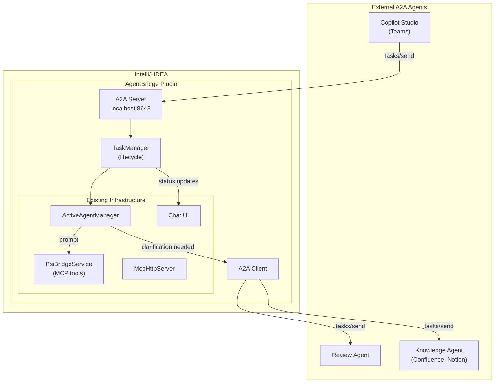
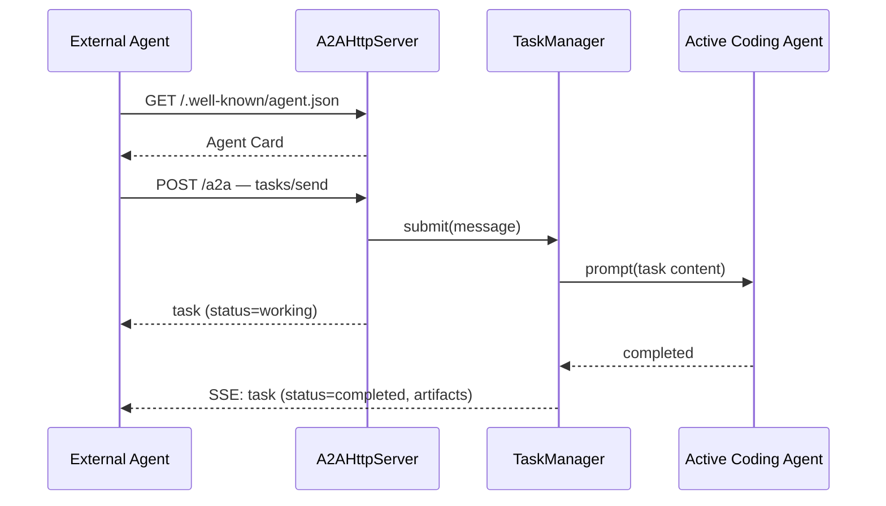
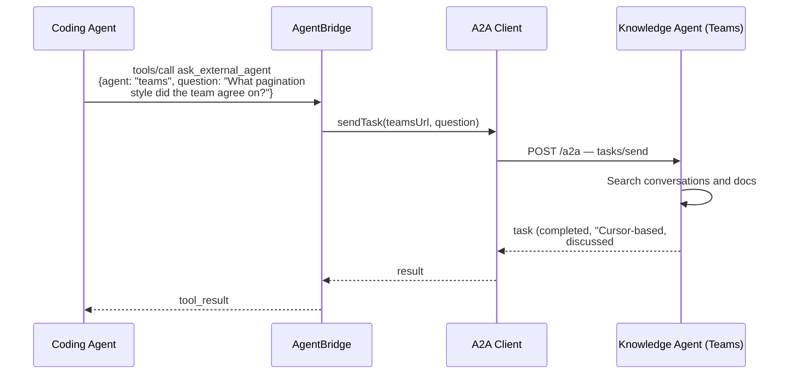

# A2A (Agent-to-Agent) Protocol Integration

## Overview

The [Agent-to-Agent (A2A) protocol](https://a2a-protocol.org/latest/) is an open
standard (Google / Linux Foundation, v1.0 GA 2026) for cross-agent communication
over HTTP, SSE, and JSON-RPC. It complements MCP: where MCP connects an agent to
**tools** (vertical), A2A connects agents to **each other** (horizontal).

This document evaluates A2A for an IDE plugin that hosts AI coding agents, lays
out the use cases where it genuinely helps, identifies where it does not, and
provides an implementation plan for both an A2A server and client.

---

## What A2A Does

A2A defines three things:

1. **Discovery** — An agent publishes an "Agent Card" at
   `/.well-known/agent.json` describing its name, skills, endpoint URL, and
   auth requirements. Any other agent can fetch this to learn what the agent
   can do.

2. **Task lifecycle** — A client submits a task (`tasks/send`), the server
   processes it and transitions through states: `submitted → working →
   completed | failed | input-required`. The `input-required` state allows
   multi-turn conversation between agents.

3. **Streaming** — Long-running tasks can stream status updates via SSE
   (`tasks/sendSubscribe`), so the caller gets incremental progress instead
   of polling.

All communication is JSON-RPC 2.0 over HTTP. Auth uses standard OAuth2 or
bearer tokens.

### A2A vs MCP

|                       | MCP                               | A2A                                          |
|-----------------------|-----------------------------------|----------------------------------------------|
| **Relationship**      | Agent → Tools                     | Agent → Agent                                |
| **Interaction model** | Stateless function calls          | Stateful task lifecycle                      |
| **Discovery**         | `tools/list` (tool catalog)       | Agent Card (agent catalog)                   |
| **Multi-turn**        | No                                | Yes (`input-required` state)                 |
| **Typical use**       | "Read this file", "Run this test" | "Implement this feature", "Review this code" |

They are complementary. An agent that receives an A2A task will typically use
MCP tools to execute it.

---

## Where A2A Brings Value

### UC1: Discussions → Implementation

**The problem:** A team discusses a feature in a meeting, standup, or chat
thread. Decisions are made, requirements are clarified. Then someone has to
manually translate that into tickets, and a developer has to read those tickets,
understand the context, and start implementing. Context is lost at every handoff.

**With A2A:** A Copilot Studio agent (or similar) processes the meeting
transcript, extracts implementation tasks with the full conversational context,
and sends them as A2A tasks directly to the developer's IDE. The coding agent
receives not just "implement pagination" but also "cursor-based, page size 20,
as discussed by the team on April 15th — see transcript excerpt."

```
Meeting / chat discussion
    → Platform agent extracts tasks with context
    → A2A task to developer's IDE
    → Coding agent begins implementation
    → Status streams back to the platform
```

**Why A2A is the right fit:** The platform agent and the IDE agent are on
different machines, run by different runtimes, and are managed by different
systems. A2A gives them a standard way to discover each other and exchange
structured tasks. Without A2A, you'd build a bespoke integration for each
platform — a Slack webhook here, a Teams bot there, a custom API for Jira.

**Who benefits:** Teams that want to shorten the path from discussion to code.
Project managers who want to see task status without switching to a different
tracking tool.

### UC2: IDE Agent → External Knowledge

**The problem:** A coding agent working on a task hits ambiguity. "Should
deleted users be soft-deleted or hard-deleted?" The agent can either ask the
developer (interrupting them) or guess (risky). Meanwhile, this question was
answered last week in a team chat, a design doc, or a Confluence page — but the
agent has no access to those systems.

**With A2A:** The coding agent sends a clarification request to an external
knowledge agent — one that has access to team conversations, documentation
wikis, design docs, or project management tools. That agent searches the
relevant sources and responds with the answer and its source.

```
Coding agent encounters ambiguity
    → A2A request to knowledge agent:
      "What's the team's convention for user deletion?"
    → Knowledge agent searches Confluence, Teams history, Notion
    → Response: "Soft delete, per design doc DB-204 (updated March 2026)"
    → Coding agent continues with the correct approach
```

**Why A2A is the right fit:** The knowledge lives in external systems (Teams,
Slack, Confluence, Notion) that the IDE agent cannot and should not access
directly. A dedicated knowledge agent with proper auth to those systems is the
right boundary. A2A's `input-required` state also handles the case where the
knowledge agent can't find the answer — it can post the question in a team
channel and wait for a human reply.

**Who benefits:** Developers working on unfamiliar codebases or across team
boundaries. The agent resolves its own ambiguities instead of blocking on human
input.

### UC3: Cross-Agent Review

**The problem:** After implementation, code needs review — security review,
performance review, compliance review. These are specialized tasks that benefit
from specialized agents with specific training or tool access (SAST scanners,
performance profilers, compliance checklists). Running multiple specialized
review agents locally is impractical.

**With A2A:** The IDE agent delegates review tasks to specialized remote agents.
A security review agent runs SAST tools and checks OWASP guidelines. A
performance agent checks for N+1 queries and missing indexes. Results come back
as structured findings.

```
Implementation complete
    → A2A: "Review this diff for SQL injection and auth bypass"
           to security-review agent
    → A2A: "Check for N+1 queries and missing index hints"
           to performance agent
    → Both return findings as task artifacts
    → IDE presents combined review results
```

**Honest caveat:** This use case is also partially achievable by calling another
LLM API directly with the diff as context. A2A's added value here is
**standardization** (any A2A-compatible review agent, not a hardcoded API
integration) and **discovery** (Agent Cards let you browse available review
agents in your organization without configuring each one manually). If your
team only uses one review tool, A2A is overhead.

**Who benefits:** Organizations with centralized security or compliance teams
that publish review agents as shared services.

---

## Where A2A Does NOT Help

### Local, single-developer workflows

A2A is an HTTP protocol with discovery, auth, and task lifecycle. If both agents
run on the same machine — or worse, in the same process — this is unnecessary
overhead. A function call or in-process message is simpler, faster, and more
reliable.

**Example:** An IDE plugin that hosts Claude and Copilot side by side does not
need A2A to let them collaborate. They share the same MCP tools and the same
project context. Routing a request through HTTP, Agent Cards, and task state
machines adds latency and failure modes without adding capability.

### Replacing simple automations

If a cron job polls GitHub Issues and sends prompts to the IDE, and it works,
adding A2A is overengineering. A2A's value comes from scenarios where the caller
and callee **don't know each other in advance** or need **bidirectional
negotiation**. A script that talks to one known endpoint has neither requirement.

### Deterministic workflows

CI/CD pipelines, build systems, and deployment tools already have well-defined
APIs, webhook systems, and error reporting. A build failure produces structured
output (exit code, error log, failing test name). Wrapping this in an A2A task
lifecycle adds no information — the IDE can already parse the build output
directly.

A2A is designed for tasks where the **outcome is uncertain** and the **process
involves reasoning**. "Parse this build log" is not that. "Diagnose why this
test fails intermittently across environments" might be — but even then, the
developer already has the build output locally.

### When the ecosystem is not there yet

A2A is most valuable when there are many agents to connect to. As of mid-2026:

- **Microsoft Copilot Studio** — Full A2A support (GA April 2026)
- **Slack** — No native A2A. Uses MCP for tool integration. Third-party bridges
  exist but add complexity
- **GitHub** — No native A2A. Copilot uses ACP/MCP
- **Jira, Confluence, Notion** — No A2A agents yet (likely coming)

The Copilot Studio ecosystem is the strongest argument for A2A today. For
Slack-based teams, the value is not yet there without building middleware.

---

## A2A Protocol Details

### Agent Card (Discovery)

Every A2A agent publishes a JSON manifest at `/.well-known/agent.json`:

```json
{
  "name": "AgentBridge IDE",
  "description": "IntelliJ IDE agent — code editing, navigation, testing, git",
  "url": "http://localhost:8643/a2a",
  "version": "1.0",
  "capabilities": {
    "streaming": true,
    "pushNotifications": false
  },
  "skills": [
    {
      "id": "implement",
      "name": "Implement Feature",
      "description": "Implement a feature from a natural language description",
      "tags": [
        "coding",
        "implementation"
      ]
    },
    {
      "id": "fix-bug",
      "name": "Fix Bug",
      "description": "Diagnose and fix a bug from error logs or description",
      "tags": [
        "debugging",
        "bugfix"
      ]
    },
    {
      "id": "review",
      "name": "Code Review",
      "description": "Review code changes for quality, security, and correctness",
      "tags": [
        "review",
        "quality"
      ]
    }
  ],
  "authentication": {
    "schemes": [
      "bearer"
    ]
  }
}
```

### Task Lifecycle

```
                  ┌─────────┐
                  │submitted│
                  └────┬────┘
                       │
                  ┌────▼────┐
              ┌───│ working │───┐
              │   └────┬────┘   │
              │        │        │
         ┌────▼───┐ ┌──▼───┐ ┌─▼──────┐
         │input-  │ │comp- │ │failed  │
         │required│ │leted │ │        │
         └────┬───┘ └──────┘ └────────┘
              │
              │  (client sends reply)
              │
         ┌────▼────┐
         │ working │ (resumes)
         └─────────┘
```

The `input-required` state is what makes A2A more than a simple request/response
protocol. It allows multi-turn agent conversations: the IDE agent asks the Teams
agent for clarification, the Teams agent posts in a channel and waits, a human
replies, and the Teams agent forwards the answer back. The task stays open
throughout.

### JSON-RPC Methods

| Method                | Direction       | Purpose                                        |
|-----------------------|-----------------|------------------------------------------------|
| `tasks/send`          | Client → Server | Submit a new task or reply to `input-required` |
| `tasks/get`           | Client → Server | Poll task status                               |
| `tasks/cancel`        | Client → Server | Cancel a running task                          |
| `tasks/sendSubscribe` | Client → Server | Submit and stream updates via SSE              |

### Message Format

```json
{
  "jsonrpc": "2.0",
  "id": "req-1",
  "method": "tasks/send",
  "params": {
    "id": "task-uuid-123",
    "message": {
      "role": "user",
      "parts": [
        {
          "type": "text",
          "text": "Implement pagination for GET /api/users. Page size 20, cursor-based."
        },
        {
          "type": "data",
          "mimeType": "application/json",
          "data": {
            "source": "teams-standup-2026-04-19",
            "priority": "high"
          }
        }
      ]
    }
  }
}
```

---

## Architecture

### System Diagram



### How A2A Components Relate to Existing Code

```
McpHttpServer (existing)          A2AHttpServer (new)
       │                                 │
       ▼                                 ▼
McpProtocolHandler              A2AProtocolHandler
       │                                 │
       ▼                                 ▼
PsiBridgeService  ◄──────────── TaskManager
(MCP tools)                      │         │
                                 ▼         ▼
                          TaskRunner    A2AClient
                          (inbound)    (outbound)
                                 │
                                 ▼
                         ActiveAgentManager
                         (prompt the agent)
```

The A2A server follows the same pattern as the existing MCP HTTP server:
project-level service, localhost by default, `com.sun.net.httpserver.HttpServer`.
It listens on a separate port to avoid interference with MCP clients.

---

## Implementation Plan

### Phase 1: A2A Server — Receive Tasks from External Agents

**Goal:** External agents (Copilot Studio, custom agents) can send implementation
tasks to the IDE. The developer sees incoming tasks, approves or rejects them,
and the active coding agent executes them.

#### New Files

```
a2a/
├── server/
│   ├── A2AHttpServer.java              — HTTP server on configurable port
│   ├── A2AProtocolHandler.java         — JSON-RPC handler (tasks/send, get, cancel)
│   ├── AgentCardEndpoint.java          — Serves /.well-known/agent.json
│   └── A2AServerSettings.java         — Persistent settings (port, auth)
├── model/
│   ├── AgentCard.java                  — Agent Card POJO
│   ├── A2ATask.java                    — Task state machine
│   ├── TaskMessage.java                — Message with typed parts
│   ├── TaskPart.java                   — TextPart, DataPart, FilePart
│   └── TaskStatus.java                — submitted/working/completed/failed/input-required
├── task/
│   ├── TaskManager.java               — In-memory task store + lifecycle
│   ├── TaskRunner.java                — Bridges A2A task → agent prompt
│   └── TaskNotifier.java             — SSE streaming of status updates
└── ui/
    ├── A2ATaskPanel.java              — Task inbox in tool window
    └── A2ASettingsConfigurable.java   — Settings UI
```

#### Server Startup

```java

@Service(Service.Level.PROJECT)
public final class A2AHttpServer implements Disposable {

    private HttpServer httpServer;
    private final A2AProtocolHandler protocolHandler;
    private final TaskManager taskManager;

    public void start(int port) {
        httpServer = HttpServer.create(
                new InetSocketAddress("127.0.0.1", port), 0);
        httpServer.createContext(
                "/.well-known/agent.json", this::handleAgentCard);
        httpServer.createContext("/a2a", this::handleA2A);
        httpServer.createContext("/health", this::handleHealth);
        httpServer.start();
    }
}
```

#### Task Manager

Bridges external A2A tasks to the active agent:

```java

@Service(Service.Level.PROJECT)
public final class TaskManager implements Disposable {

    private final Map<String, A2ATask> tasks = new ConcurrentHashMap<>();

    public A2ATask submit(TaskMessage message) {
        var task = new A2ATask(UUID.randomUUID().toString(), message);
        tasks.put(task.id(), task);

        var agent = ActiveAgentManager.getInstance(project).getClient();
        if (agent == null || !agent.isConnected()) {
            task.setStatus(TaskStatus.FAILED, "No active agent");
            return task;
        }

        task.setStatus(TaskStatus.WORKING);
        agent.sendPrompt(buildPromptFromTask(task), new AgentListener() {
            @Override
            public void onComplete(String response) {
                task.addArtifact(new TextPart(response));
                task.setStatus(TaskStatus.COMPLETED);
                notifySubscribers(task);
            }

            @Override
            public void onError(String error) {
                task.setStatus(TaskStatus.FAILED, error);
                notifySubscribers(task);
            }
        });

        return task;
    }

    public void requestInput(String taskId, String question) {
        var task = tasks.get(taskId);
        task.addMessage(new TaskMessage("agent", new TextPart(question)));
        task.setStatus(TaskStatus.INPUT_REQUIRED);
        notifySubscribers(task);
    }

    public void replyToTask(String taskId, TaskMessage reply) {
        var task = tasks.get(taskId);
        task.addMessage(reply);
        task.setStatus(TaskStatus.WORKING);
        resumeAgent(task, reply);
    }
}
```

#### Agent Card

Generated dynamically from the plugin's current state:

```java
public final class AgentCardEndpoint {

    public JsonObject buildAgentCard(Project project) {
        var card = new JsonObject();
        card.addProperty("name", "AgentBridge IDE");
        card.addProperty("url",
                "http://localhost:" + getPort() + "/a2a");
        card.addProperty("version", "1.0");

        var skills = new JsonArray();
        skills.add(skill("implement", "Implement Feature",
                "Implement a feature from natural language"));
        skills.add(skill("fix-bug", "Fix Bug",
                "Diagnose and fix a bug"));
        skills.add(skill("review", "Code Review",
                "Review changes for correctness and security"));
        card.add("skills", skills);

        var caps = new JsonObject();
        caps.addProperty("streaming", true);
        caps.addProperty("pushNotifications", false);
        card.add("capabilities", caps);

        return card;
    }
}
```

#### Task Inbox UI

```
┌─ A2A Tasks ──────────────────────────────────────────────┐
│                                                          │
│  ● working   Implement pagination for /api/users   Teams │
│  ◌ pending   Add rate limiting to webhook endpoint  PM   │
│  ✓ done      Update error messages per style guide  QA   │
│                                                          │
│  ──────────────────────────────────────────────────────── │
│  Source: Teams standup 2026-04-19                         │
│  Status: working (3m 22s)                                │
│  [View in Chat] [Cancel] [Reject]                        │
└──────────────────────────────────────────────────────────┘
```

#### Inbound Flow



---

### Phase 2: A2A Client — Delegate Tasks to External Agents

**Goal:** The coding agent in the IDE can reach out to external agents — to ask
questions, request reviews, or delegate specialized work.

#### New Files

```
a2a/
├── client/
│   ├── A2AClient.java                 — HTTP client for A2A JSON-RPC
│   ├── AgentCardDiscovery.java        — Fetch and cache agent cards
│   └── RemoteAgentRegistry.java       — Configured remote agents
└── tools/
    ├── DelegateToAgentTool.java        — MCP tool: delegate_to_agent
    └── AskExternalAgentTool.java       — MCP tool: ask_external_agent
```

#### A2A Client

```java
public final class A2AClient {

    private final OkHttpClient http;
    private final Map<String, AgentCard> cardCache
            = new ConcurrentHashMap<>();

    public AgentCard discover(String agentUrl) {
        return cardCache.computeIfAbsent(agentUrl, url -> {
            var response = http.newCall(new Request.Builder()
                    .url(url + "/.well-known/agent.json")
                    .build()
            ).execute();
            return AgentCard.fromJson(response.body().string());
        });
    }

    public A2ATask sendTask(
            String agentUrl,
            TaskMessage message,
            Duration timeout) {
        // POST tasks/send, then poll tasks/get until
        // completed, failed, or timeout
    }

    public void sendTaskStreaming(
            String agentUrl,
            TaskMessage message,
            Consumer<A2ATask> onUpdate) {
        // POST tasks/sendSubscribe, consume SSE stream
    }
}
```

#### MCP Tools

Two new MCP tools expose A2A delegation to any agent running in the plugin:

**`delegate_to_agent`** — Full task delegation with structured response:

```json
{
  "name": "delegate_to_agent",
  "description": "Delegate a task to an external A2A agent and wait for the result.",
  "inputSchema": {
    "properties": {
      "agent": {
        "type": "string",
        "description": "Agent name or URL"
      },
      "task": {
        "type": "string",
        "description": "Task description"
      },
      "timeout_seconds": {
        "type": "integer",
        "default": 120
      }
    },
    "required": [
      "agent",
      "task"
    ]
  }
}
```

**`ask_external_agent`** — Quick question, text response:

```json
{
  "name": "ask_external_agent",
  "description": "Ask an external A2A agent a question. Use for clarifications from team knowledge bases, conversation history, or documentation.",
  "inputSchema": {
    "properties": {
      "agent": {
        "type": "string",
        "description": "Agent name or URL"
      },
      "question": {
        "type": "string"
      }
    },
    "required": [
      "agent",
      "question"
    ]
  }
}
```

#### Outbound Flow (Clarification Example)



---

### Phase 3: UI — Agent Registry, Task Inbox, Settings

#### Agent Registry (Settings)

```
┌─ A2A Agent Registry ─────────────────────────────────────┐
│                                                          │
│  Name              URL                        Status     │
│  ─────────────────────────────────────────────────────── │
│  Teams (Copilot)   https://copilot.ms/a2a     ● Online  │
│  Security Review   http://sec-agent.int:8080  ● Online  │
│                                                          │
│  [Add Agent]  [Discover from URL]  [Remove]              │
│                                                          │
│  ☑ Auto-accept tasks from trusted agents                │
│  ☐ Require approval for all incoming tasks              │
│  ☑ Allow IDE agent to delegate to registered agents     │
│                                                          │
│  A2A Server                                              │
│  Port: [8643]  ☑ Auto-start  ☑ Require auth token       │
│  Auth token: [••••••••••••]  [Regenerate]                │
└──────────────────────────────────────────────────────────┘
```

#### Incoming Task Approval

```
┌─ Incoming A2A Task ──────────────────────────────────────┐
│                                                          │
│  From: Teams (Copilot Studio)                            │
│  Skill: implement                                        │
│                                                          │
│  "Implement cursor-based pagination for GET /api/users.  │
│   Page size 20, include total count in response header.  │
│   Based on discussion in #backend standup Apr 19."       │
│                                                          │
│  Context:                                                │
│   • Source: Teams standup transcript                      │
│   • Priority: high                                       │
│   • Related: PROJ-445                                    │
│                                                          │
│  [Accept & Start]  [Queue]  [Reject]                     │
└──────────────────────────────────────────────────────────┘
```

---

## Security

### Authentication

- **Server:** Bearer token (configurable, auto-generated). External agents must
  include it in the `Authorization` header. The token is referenced in the
  Agent Card's `authentication` section.
- **Client:** Per-agent auth in the registry. Supports bearer tokens and OAuth2
  (required for Copilot Studio).

### Localhost Default

The A2A server binds to `127.0.0.1` by default. For remote access, the
developer must explicitly configure a bind address and enable authentication.
This matches the existing MCP server's security model.

### Permission Passthrough

A2A tasks execute through the same permission system as manual prompts. If
`git_push` requires approval when the developer types a prompt, it requires
approval when triggered by an A2A task. An external agent cannot escalate
privileges.

---

## Configuration

### Server

| Setting                        | Default     | Description                      |
|--------------------------------|-------------|----------------------------------|
| `a2a.server.enabled`           | `false`     | Enable A2A server                |
| `a2a.server.port`              | `8643`      | Server port                      |
| `a2a.server.autoStart`         | `false`     | Start on project open            |
| `a2a.server.authToken`         | (generated) | Bearer token                     |
| `a2a.server.bindAddress`       | `127.0.0.1` | Bind address                     |
| `a2a.server.autoAcceptTrusted` | `true`      | Skip approval for trusted agents |

### Client

| Setting                     | Default | Description              |
|-----------------------------|---------|--------------------------|
| `a2a.client.enabled`        | `false` | Enable A2A client tools  |
| `a2a.client.defaultTimeout` | `120s`  | Task timeout             |
| `a2a.agents`                | `[]`    | Registered remote agents |

---

## Ecosystem Status (April 2026)

| Platform                     | A2A Support     | Notes                                        |
|------------------------------|-----------------|----------------------------------------------|
| **Microsoft Copilot Studio** | GA (April 2026) | Full A2A, Agent Store with 70+ agents        |
| **Slack**                    | No native A2A   | Uses MCP. Third-party bridges exist (kagent) |
| **GitHub**                   | No native A2A   | Uses ACP/MCP. Community wrapper exists       |
| **Jira / Confluence**        | Not yet         | Likely coming via Atlassian's agent platform |
| **ServiceNow**               | A2A available   | Enterprise workflow agents                   |
| **SAP**                      | A2A available   | Business process agents                      |

The strongest integration path today is **Copilot Studio**. For Slack-centric
teams, A2A adds a middleware layer that may not justify its complexity until
Slack ships native support.

### Copilot Studio Connection

1. Register the IDE as a "Custom agent" in Copilot Studio using the Agent Card
   URL
2. Configure OAuth2 or bearer token auth
3. Copilot Studio agents can now send `tasks/send` to the IDE
4. The IDE can discover Copilot Studio agents via their published Agent Cards

See: [Connect to an agent over A2A — Microsoft Learn](https://learn.microsoft.com/en-us/microsoft-copilot-studio/add-agent-agent-to-agent)

---

## Rollout Plan

| Phase | Scope                                | Effort    | Depends On     |
|-------|--------------------------------------|-----------|----------------|
| **1** | A2A Server (receive tasks)           | 2-3 weeks | —              |
| **2** | A2A Client (delegate + MCP tools)    | 2 weeks   | Phase 1 models |
| **3** | UI (task inbox, registry, settings)  | 1-2 weeks | Phase 1 + 2    |
| **4** | Copilot Studio integration testing   | 1 week    | Phase 1 + 2    |
| **5** | SSE streaming for long-running tasks | 1 week    | Phase 1        |

---

## Summary

A2A is worth implementing for **cross-platform agent communication** — primarily
receiving tasks from enterprise collaboration platforms (Teams/Copilot Studio)
and sending clarification requests back. It is **not** a replacement for simple
scripts, local agent orchestration, or deterministic CI/CD integrations.

The strongest near-term value is the **Teams ↔ IDE loop**: discussions become
implementation tasks (UC1), and the coding agent can consult team knowledge
when it needs context (UC2). Cross-agent review (UC3) is a secondary benefit
that grows with organizational adoption of A2A-compatible review agents.

---

## References

- [A2A Protocol Specification](https://a2a-protocol.org/latest/)
- [Microsoft Copilot Studio A2A](https://learn.microsoft.com/en-us/microsoft-copilot-studio/add-agent-agent-to-agent)
- [Microsoft A2A blog post](https://www.microsoft.com/en-us/microsoft-cloud/blog/2025/05/07/empowering-multi-agent-apps-with-the-open-agent2agent-a2a-protocol/)
- [Existing MCP Architecture](MCP-ARCHITECTURE.md)
- [Plugin Architecture](ARCHITECTURE.md)
