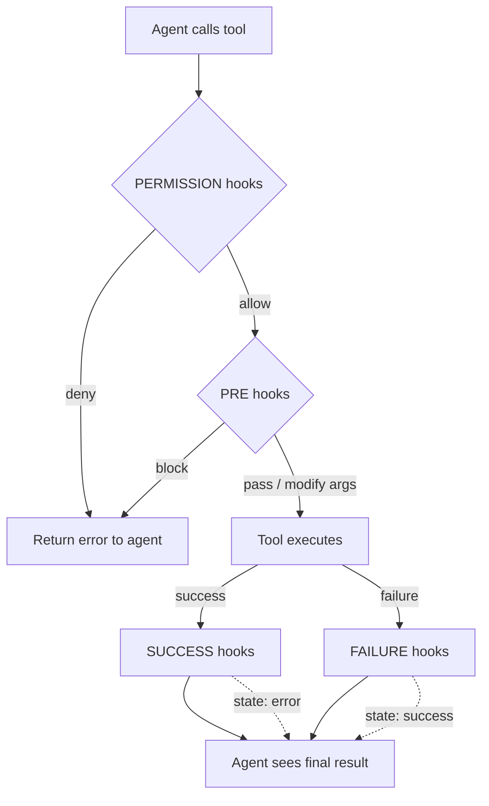

# MCP Tool Hooks

MCP Tool Hooks let you intercept every tool call an AI agent makes — before execution, after
success, or after failure — and run shell scripts that can modify arguments, transform output,
change error state, or deny execution entirely.

This creates a **closed feedback loop** between the agent and your project's policies: hook scripts
receive structured JSON on stdin, make decisions, and write JSON to stdout. The MCP server reads
that response and uses it to shape what the agent perceives. The agent never sees the hook — it
only sees the final result.

## Quick Start

1. **Create the hooks directory** inside your project's AgentBridge storage directory
   (default: `<project>/.agentbridge/hooks/`):

   ```
   .agentbridge/
   └── hooks/
       ├── git_commit.json        ← hooks for the git_commit tool
       ├── run_command.json        ← hooks for the run_command tool
       └── scripts/
           ├── enforce-author.sh   ← shared script
           └── enforce-gh-bot.sh
   ```

2. **Create a hook config** — one JSON file per MCP tool, named `<tool-id>.json`:

   ```json
   {
     "pre": [
       {
         "script": "scripts/enforce-author.sh",
         "failSilently": false
       }
     ]
   }
   ```

3. **Write the hook script** — receives JSON on stdin, writes JSON to stdout:

   ```bash
   #!/usr/bin/env bash
   set -euo pipefail
   payload=$(</dev/stdin)
   echo "$payload" | python3 -c "
   import sys, json
   p = json.load(sys.stdin)
   args = p['arguments']
   args['author'] = 'Bot <bot@example.com>'
   print(json.dumps({'arguments': args}))
   "
   ```

That's it. The next time the agent calls `git_commit`, the pre-hook silently sets the author.

## How It Works



## Hook File Format

Each file is named after the MCP tool it applies to: `<tool-id>.json`.

```json
{
  "permission": [{ "script": "scripts/check-policy.sh" }],
  "pre":        [{ "script": "scripts/sanitize-args.sh" }],
  "success":    [{ "script": "scripts/post-tips.sh", "async": true }],
  "failure":    [{ "script": "scripts/retry-build.sh", "timeout": 120 }]
}
```

### Entry Fields

| Field            | Type    | Default                           | Description                        |
|-----------------|---------|-----------------------------------|------------------------------------|
| `script`         | string  | *required*                        | Path to script (relative to hooks dir) |
| `failSilently`   | boolean | `true` (permission: `false`)      | Log and continue on script failure |
| `async`          | boolean | `false`                           | Fire-and-forget (no result read)   |
| `timeout`        | int     | `10`                              | Max seconds before process kill    |
| `env`            | object  | `{}`                              | Extra environment variables        |

## Trigger Reference

### `permission` — Gate Execution

Runs before the tool executes. All entries must allow; any deny stops the chain.

**Input (stdin):**
```json
{
  "toolName": "git_push",
  "arguments": { "branch": "main" },
  "argumentsJson": "{\"branch\":\"main\"}",
  "projectName": "my-project",
  "timestamp": "2025-05-03T12:00:00Z"
}
```

**Output (stdout):**
```json
{"decision": "allow"}
```
```json
{"decision": "deny", "reason": "Cannot push to protected branch 'main'"}
```

### `pre` — Modify Arguments or Block

Runs after permission, before the tool executes. Can modify arguments or block with an error.

**Output:**
```json
{"arguments": {"message": "feat: updated message", "all": true}}
```
```json
{"error": "Commit message does not follow conventional commits"}
```

**Important:** When modifying arguments, return the **complete** arguments object — the entire
object is replaced, not merged.

### `success` — Transform Successful Output

Runs after the tool succeeds. Can replace output, append to it, or change the error state.

**Input (stdin):** Same as permission, plus:
```json
{
  "output": "Committed abc1234 on feat/hooks",
  "error": false,
  "durationMs": 1523
}
```

**Output:**
```json
{"output": "Committed abc1234. Remember to create a PR."}
```
```json
{"append": "\nTip: run tests before pushing."}
```

### `failure` — Transform or Recover from Errors

Runs after the tool fails. Can modify the error message, append context, or **resolve the error
to a success**.

**Output:**
```json
{"output": "Build succeeded after clean rebuild", "state": "success"}
```
```json
{"append": "\nSuggestion: try ./gradlew clean first"}
```

## State Override

Success and failure hooks can change the error state by including a `"state"` field:

| Value       | Effect                                                        |
|------------|---------------------------------------------------------------|
| `"success"` | Mark result as successful (even if it was a failure)         |
| `"error"`   | Mark result as error (even if the tool succeeded)            |
| *(absent)*  | Keep the current state                                        |

This enables patterns like:
- **Auto-retry:** A failure hook runs `gradle clean build`. If it succeeds, it returns
  `{"output": "Build passed after retry", "state": "success"}` — the agent sees a success.
- **Policy enforcement:** A success hook detects a policy violation and returns
  `{"output": "Blocked: output contains credentials", "state": "error"}`.

## Hook Chaining

Multiple entries per trigger run sequentially. Each entry receives the **current** state
(including modifications from previous entries in the chain):

```json
{
  "success": [
    { "script": "scripts/add-review-link.sh" },
    { "script": "scripts/append-tips.sh" }
  ]
}
```

The second script sees the output as modified by the first.

## Identity Enforcement Example

A common use case is preventing the agent from posting GitHub content (PRs, comments, issues)
as the repository owner. This project ships with three enforcement hooks:

### `git_commit.json` — Silent Author Fix

```json
{
  "pre": [{
    "script": "scripts/enforce-commit-author.sh",
    "failSilently": false,
    "timeout": 5
  }]
}
```

The script reads the full arguments, overrides the `author` field, and returns the modified
arguments. The agent never knows the author was changed.

### `run_command.json` — GitHub CLI Interception

```json
{
  "pre": [{
    "script": "scripts/enforce-gh-bot-identity.sh",
    "failSilently": false,
    "timeout": 5
  }]
}
```

Detects `gh pr create`, `gh issue create`, `gh pr comment`, and similar commands.
If `AGENTBRIDGE_BOT_TOKEN` is set (or `~/.agentbridge/bot-token` exists), it silently
prepends `GH_TOKEN=...` to the command. Otherwise, it blocks with an actionable error:

```
Identity policy: this command would post GitHub content as the repository owner.
Set AGENTBRIDGE_BOT_TOKEN or create ~/.agentbridge/bot-token with a bot PAT.
```

### `http_request.json` — GitHub API Interception

Same approach for direct HTTP requests to `api.github.com` with write methods (POST/PATCH/PUT).
Injects or replaces the `Authorization` header with the bot token.

### Setting Up a Bot Token

1. **Create a GitHub fine-grained PAT** for a bot account (or a machine user) with the
   required repository permissions (issues, pull requests, discussions).
2. **Store it** in one of:
   - Environment variable: `export AGENTBRIDGE_BOT_TOKEN=ghp_...`
   - File: `~/.agentbridge/bot-token` (single line, no trailing newline)
3. The hooks read the token at runtime — no restart needed.

## Script Protocol Reference

### Environment

Scripts run with:
- **Working directory:** The hooks directory (where the JSON config lives)
- **stdin:** JSON payload (tool name, arguments, output, error state, timing)
- **stdout:** JSON response (the hook's decision/modification)
- **stderr:** Logged by AgentBridge but otherwise ignored
- **Extra env vars:** From the `env` field in the hook entry

### Exit Codes

| Code | Meaning                                                          |
|------|------------------------------------------------------------------|
| `0`  | Success — stdout is parsed as the hook's response                |
| `≠0` | Failure — if `failSilently: true`, logged and skipped; otherwise propagated as error |

### Payload Fields

| Field           | Type    | Triggers                    | Description                    |
|----------------|---------|-----------------------------|--------------------------------|
| `toolName`      | string  | all                         | MCP tool ID                    |
| `arguments`     | object  | all                         | Tool arguments as JSON object  |
| `argumentsJson` | string  | all                         | Arguments as JSON string       |
| `projectName`   | string  | all                         | IntelliJ project name          |
| `timestamp`     | string  | all                         | ISO 8601 timestamp             |
| `output`        | string  | success, failure            | Tool output text               |
| `error`         | boolean | success, failure            | Current error state            |
| `durationMs`    | long    | success, failure            | Tool execution time in ms      |

## Storage Location

Hooks are stored in the `hooks/` subdirectory of the project's AgentBridge storage directory.
The storage location is configured in **Settings → Tools → AgentBridge → Storage**:

| Mode      | Hooks directory                                            |
|----------|------------------------------------------------------------|
| Project   | `<project>/.agentbridge/hooks/`                            |
| User Home | `~/.agentbridge/projects/<project-name>-<hash>/hooks/`     |
| Custom    | `<custom-root>/projects/<project-name>-<hash>/hooks/`      |

## Comparison with GitHub Copilot Hooks

| Capability                     | Copilot Hooks | AgentBridge Hooks |
|--------------------------------|---------------|-------------------|
| Pre-tool deny                  | ✅             | ✅                 |
| Pre-tool argument modification | ❌             | ✅                 |
| Post-tool output modification  | ❌             | ✅                 |
| Post-tool output append        | ❌             | ✅                 |
| Error state override           | ❌             | ✅                 |
| Hook chaining                  | ❌             | ✅                 |
| Per-tool configuration         | ✅             | ✅                 |
| Async (fire-and-forget) mode   | ✅             | ✅                 |
| JSON stdin/stdout protocol     | ❌             | ✅                 |
| Hooks outside of tool calls    | ✅             | ❌                 |
