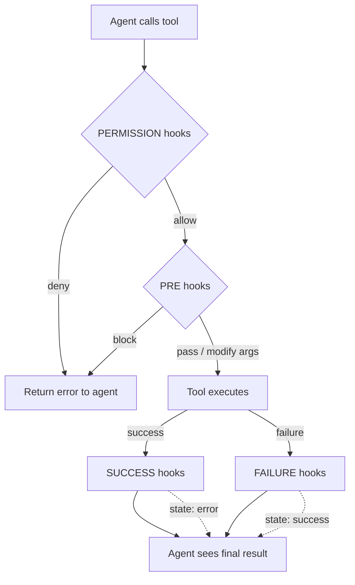

# MCP Tool Hooks

MCP Tool Hooks let you intercept every tool call an AI agent makes — before execution, after
success, or after failure — and run shell scripts that can modify arguments, transform output,
change error state, or deny execution entirely.

This creates a **closed feedback loop** between the agent and your project's policies: hook scripts
receive structured JSON on stdin, make decisions, and write JSON to stdout. The MCP server reads
that response and uses it to shape what the agent perceives. The agent never sees the hook — it
only sees the final result.

## Quick Start

The plugin ships with **built-in default hooks** that are automatically provisioned when
you first open a project (if no hook configs exist yet). These defaults include identity
enforcement, command safety gates, and post-execution tips.

To customize: edit the files in `<project>/.agentbridge/hooks/`.
To reset: use **Settings → Tools → Restore Default Hooks**.

### Directory Structure

The hooks directory lives inside your project's AgentBridge storage directory
(default: `<project>/.agentbridge/hooks/`):

   ```
   .agentbridge/
   └── hooks/
       ├── git_commit.json        ← hooks for the git_commit tool
       ├── run_command.json        ← hooks for the run_command tool
       └── scripts/
           ├── _lib.sh             ← shared POSIX shell library
           ├── enforce-author.sh   ← shared script
           └── enforce-gh-bot.sh
   ```

2. **Create a hook config** — one JSON file per MCP tool, named `<tool-id>.json`:

   ```json
   {
     "pre": [
       {
         "script": "scripts/enforce-author.sh",
         "failSilently": false
       }
     ]
   }
   ```

3. **Write the hook script** — receives JSON on stdin, writes JSON to stdout:

   ```sh
   #!/bin/sh
   . "${0%/*}/_lib.sh"
   hook_read_payload

   author=$(hook_get_arg author)
   hook_json_args "\"author\":\"Bot <bot@example.com>\""
   ```

That's it. The next time the agent calls `git_commit`, the pre-hook silently sets the author.

## How It Works



## Hook File Format

Each file is named after the MCP tool it applies to: `<tool-id>.json`.

```json
{
  "permission": [{ "script": "scripts/check-policy.sh" }],
  "pre":        [{ "script": "scripts/sanitize-args.sh" }],
  "success":    [{ "script": "scripts/post-tips.sh", "async": true }],
  "failure":    [{ "script": "scripts/retry-build.sh", "timeout": 120 }],
  "prependString": "IMPORTANT: Follow project conventions.",
  "appendString": "\n\nRemember: run tests before committing."
}
```

### Entry Fields

| Field          | Type    | Default                      | Description                            |
|----------------|---------|------------------------------|----------------------------------------|
| `script`       | string  | *required*                   | Path to script (relative to hooks dir) |
| `failSilently` | boolean | `true` (permission: `false`) | Log and continue on script failure     |
| `async`        | boolean | `false`                      | Fire-and-forget (no result read)       |
| `timeout`      | int     | `10`                         | Max seconds before process kill        |
| `env`          | object  | `{}`                         | Extra environment variables            |

### Static Text Modifiers

For simple use cases where you want to prepend or append static text to every tool response
without writing a script, use the top-level `prependString` and `appendString` fields:

```json
{
  "prependString": "CONTEXT: This project uses conventional commits.\n\n",
  "appendString": "\n\nReminder: run tests before pushing."
}
```

| Field           | Type   | Description                              |
|-----------------|--------|------------------------------------------|
| `prependString` | string | Text prepended to successful tool output |
| `appendString`  | string | Text appended to successful tool output  |

These fields are applied **after** all success hook scripts have run. They can be combined with
scripts — the `prependString` is added before the output, and `appendString` after it.

## Hot-Reload

Hook configs are **automatically reloaded** without restarting the IDE. The registry uses a
2-second cache window — any changes to hook JSON files in the hooks directory are picked up
within 2 seconds of the next tool call.

This means you can:

- Edit hook JSON files while an agent session is active
- Add new hook configs for tools that weren't hooked before
- Remove hooks by deleting the JSON file
- All changes take effect on the next tool call (within 2 seconds)

## Settings UI

Each tool in **Settings → Tools → AgentBridge → Tools** shows a 🪝 icon when hooks are
configured for it. Clicking the tool row opens a dialog where you can:

- Edit **Prepend Text** and **Append Text** (static text modifiers)
- Add, edit, and remove hook entries per trigger (Permission, Pre, Success, Failure)
- Configure entry fields: script path, timeout, failSilently, async, environment variables
- Open the raw JSON file for advanced editing

Changes made in the settings UI are written directly to the hook JSON files and take effect
immediately (hot-reload).

## Side Panel Hook Indicator

The **Tool Calls** side panel shows a 🪝 icon next to the display name of any tool call
that had active hook configuration. When you expand a tool call, the detail view shows
**"Hooks: Active 🪝"** in the metadata section.

This provides visibility into which tool calls were intercepted by hooks, making it easy
to verify that your hook configurations are working as expected.

## Trigger Reference

### `permission` — Gate Execution

Runs before the tool executes. All entries must allow; any deny stops the chain.

**Input (stdin):**

```json
{
  "toolName": "git_push",
  "arguments": { "branch": "main" },
  "argumentsJson": "{\"branch\":\"main\"}",
  "projectName": "my-project",
  "timestamp": "2025-05-03T12:00:00Z"
}
```

**Output (stdout):**

```json
{"decision": "allow"}
```

```json
{"decision": "deny", "reason": "Cannot push to protected branch 'main'"}
```

### `pre` — Modify Arguments or Block

Runs after permission, before the tool executes. Can modify arguments or block with an error.

**Output:**

```json
{"arguments": {"message": "feat: updated message", "all": true}}
```

```json
{"error": "Commit message does not follow conventional commits"}
```

**Merge semantics:** When modifying arguments, return only the fields you want to change.
The returned fields are merged onto the original arguments — unmentioned fields are preserved.
This means you don't need to echo the entire arguments object back.

### `success` — Transform Successful Output

Runs after the tool succeeds. Can replace output, append to it, or change the error state.

**Input (stdin):** Same as permission, plus:

```json
{
  "output": "Committed abc1234 on feat/hooks",
  "error": false,
  "durationMs": 1523
}
```

**Output:**

```json
{"output": "Committed abc1234. Remember to create a PR."}
```

```json
{"append": "\nTip: run tests before pushing."}
```

### `failure` — Transform or Recover from Errors

Runs after the tool fails. Can modify the error message, append context, or **resolve the error
to a success**.

**Output:**

```json
{"output": "Build succeeded after clean rebuild", "state": "success"}
```

```json
{"append": "\nSuggestion: try ./gradlew clean first"}
```

## State Override

Success and failure hooks can change the error state by including a `"state"` field:

| Value       | Effect                                               |
|-------------|------------------------------------------------------|
| `"success"` | Mark result as successful (even if it was a failure) |
| `"error"`   | Mark result as error (even if the tool succeeded)    |
| *(absent)*  | Keep the current state                               |

This enables patterns like:

- **Auto-retry:** A failure hook runs `gradle clean build`. If it succeeds, it returns
  `{"output": "Build passed after retry", "state": "success"}` — the agent sees a success.
- **Policy enforcement:** A success hook detects a policy violation and returns
  `{"output": "Blocked: output contains credentials", "state": "error"}`.

## Hook Chaining

Multiple entries per trigger run sequentially. Each entry receives the **current** state
(including modifications from previous entries in the chain):

```json
{
  "success": [
    { "script": "scripts/add-review-link.sh" },
    { "script": "scripts/append-tips.sh" }
  ]
}
```

The second script sees the output as modified by the first.

## Script Protocol Reference

### Environment Variables

Scripts run with the following environment variables, injected automatically by the hook
executor. These are available to every hook script without configuration.

#### Project Context

| Variable                      | Description                                            | Example                        |
|-------------------------------|--------------------------------------------------------|--------------------------------|
| `AGENTBRIDGE_PROJECT_DIR`     | Absolute path to the project root                      | `/home/user/my-project`        |
| `AGENTBRIDGE_HOOKS_DIR`       | Absolute path to the hooks directory                   | `/home/user/my-project/.agentbridge/hooks` |
| `AGENTBRIDGE_MCP_PORT`        | HTTP port of the running MCP server                    | `8580`                         |
| `AGENTBRIDGE_AGENT_NAME`      | Name of the connected agent (from MCP initialize)      | `Claude Code`, `github-copilot` |
| `AGENTBRIDGE_SOURCE_ROOTS`    | Newline-separated list of source root directories      | `/home/user/my-project/src/main/java` |
| `AGENTBRIDGE_TEST_ROOTS`      | Newline-separated list of test source directories      | `/home/user/my-project/src/test/java` |
| `AGENTBRIDGE_GENERATED_ROOTS` | Newline-separated list of generated source directories | `/home/user/my-project/build/generated` |
| `AGENTBRIDGE_RESOURCE_ROOTS`  | Newline-separated list of resource directories         | `/home/user/my-project/src/main/resources` |
| `AGENTBRIDGE_EXCLUDED_DIRS`   | Newline-separated list of excluded directories         | `/home/user/my-project/build`  |

#### Tool Arguments

Every top-level string or primitive argument is also injected as `HOOK_ARG_<key>`:

| Variable              | Source                           | Example            |
|-----------------------|----------------------------------|--------------------|
| `HOOK_ARG_command`    | `arguments.command`              | `npm run build`    |
| `HOOK_ARG_path`       | `arguments.path`                 | `src/Main.java`    |
| `HOOK_ARG_message`    | `arguments.message`              | `feat: add hooks`  |

This lets scripts access arguments directly from env vars without JSON parsing:

```sh
#!/bin/sh
. "${0%/*}/_lib.sh"
command="$HOOK_ARG_command"
case "$command" in
    git*) hook_json_deny "Use the git_* tools instead of shell git" ;;
    *)    printf '{"decision":"allow"}\n' ;;
esac
```

#### Custom Environment

Additional env vars can be set per-entry via the `env` field in the hook config:

```json
{
  "pre": [{
    "script": "scripts/enforce-author.sh",
    "env": { "BOT_NAME": "my-bot", "BOT_EMAIL": "bot@example.com" }
  }]
}
```

### Working Directory

Scripts run with the hooks directory as their working directory (where the JSON config lives).

### stdin / stdout / stderr

- **stdin:** JSON payload (tool name, arguments, output, error state, timing)
- **stdout:** JSON response (the hook's decision/modification)
- **stderr:** Logged by AgentBridge but otherwise ignored

### Exit Codes

| Code | Meaning                                                                              |
|------|--------------------------------------------------------------------------------------|
| `0`  | Success — stdout is parsed as the hook's response                                    |
| `≠0` | Failure — if `failSilently: true`, logged and skipped; otherwise propagated as error |

### Payload Fields

| Field           | Type    | Triggers         | Description                   |
|-----------------|---------|------------------|-------------------------------|
| `toolName`      | string  | all              | MCP tool ID                   |
| `arguments`     | object  | all              | Tool arguments as JSON object |
| `argumentsJson` | string  | all              | Arguments as JSON string      |
| `projectName`   | string  | all              | IntelliJ project name         |
| `timestamp`     | string  | all              | ISO 8601 timestamp            |
| `output`        | string  | success, failure | Tool output text              |
| `error`         | boolean | success, failure | Current error state           |
| `durationMs`    | long    | success, failure | Tool execution time in ms     |

## Hook API

Hook scripts can call back into the IDE using HTTP endpoints on `localhost`. These endpoints
are available via the `AGENTBRIDGE_MCP_PORT` environment variable.

### `POST /hooks/query` — Query IDE State

Query IDE-specific information that shell scripts cannot compute on their own.

**Actions:**

#### `classify_path`

Classifies a file path using IntelliJ's project file index.

```sh
result=$(hook_query '{"action":"classify_path","path":"/home/user/project/src/Main.java"}')
# → {"path":"/home/user/project/src/Main.java","inProject":true,"classification":"sources","inContentRoot":true}
```

| Response field    | Type    | Description                                                       |
|-------------------|---------|-------------------------------------------------------------------|
| `path`            | string  | The requested path                                                |
| `inProject`       | boolean | Whether the path is under the project base directory              |
| `classification`  | string  | One of: `sources`, `test_sources`, `resources`, `generated_sources`, `excluded`, `content`, or `""` |
| `inContentRoot`   | boolean | Whether the file is inside a content root (and not excluded)      |

### `POST /hooks/tool` — Call Read-Only MCP Tools

Call any read-only or search MCP tool directly from a hook script. The call goes straight to the
tool's core `execute()` method — bypassing the entire agentic pipeline (no permission checks,
no hook triggering, no focus guards, no chip registry, no auto-highlights).

Only tools with `READ` or `SEARCH` kind are available. Write, execute, and delete tools are
rejected with an error.

**Request:**

```json
{"tool": "search_text", "arguments": {"query": "deprecated", "file_pattern": "*.java"}}
```

**Response (success):**

```json
{"result": "5 matches:\nsrc/Foo.java:12: ...", "error": false, "truncated": false}
```

**Response (error):**

```json
{"error": true, "message": "Tool 'write_file' is not allowed from hooks. Only read-only and search tools are available."}
```

**Available tool categories** (non-exhaustive):

| Tool                    | Kind   | Description                                    |
|-------------------------|--------|------------------------------------------------|
| `search_text`           | SEARCH | Search for text patterns across project files  |
| `search_symbols`        | SEARCH | Search for classes, methods, fields by name    |
| `find_references`       | SEARCH | Find all usages of a symbol                    |
| `read_file`             | READ   | Read file content                              |
| `get_file_outline`      | READ   | Get structure of a file (classes, methods)      |
| `list_project_files`    | READ   | List files with optional pattern filtering     |
| `list_directory_tree`   | READ   | Tree-formatted directory listing               |
| `find_file`             | READ   | Find files by name pattern                     |
| `get_project_info`      | READ   | Project name, SDK, modules                     |
| `git_status`            | READ   | Working tree status and branch info            |
| `git_diff`              | READ   | Show changes as diff                           |
| `git_log`               | READ   | Commit history                                 |
| `get_compilation_errors` | READ  | Check for compilation errors                   |
| `get_highlights`        | READ   | Get editor highlights (errors, warnings)       |

**Shell helper:**

```sh
# Search for a pattern
result=$(hook_tool "search_text" '{"query":"pattern","file_pattern":"*.java"}')

# Check compilation errors
result=$(hook_tool "get_compilation_errors" '{}')

# Read a specific file
result=$(hook_tool "read_file" '{"path":"src/Main.java"}')
```

## POSIX Shell Library (`_lib.sh`)

AgentBridge ships a shared POSIX shell library that provides helpers for all common hook
operations. Source it at the top of every hook script:

```sh
#!/bin/sh
. "${0%/*}/_lib.sh"
```

### Payload Helpers

| Function               | Description                                         |
|------------------------|-----------------------------------------------------|
| `hook_read_payload`    | Reads and caches stdin JSON payload                 |
| `hook_get <field>`     | Extract a top-level string from the cached payload  |
| `hook_get_arg <field>` | Extract `arguments.<field>` (prefers `HOOK_ARG_*` env var) |

### Response Helpers

| Function                     | Description                                |
|------------------------------|--------------------------------------------|
| `hook_json_deny <reason>`    | Emit deny decision (PERMISSION hooks)      |
| `hook_json_error <msg>`      | Emit blocking error (PRE hooks)            |
| `hook_json_append <text>`    | Emit append modifier (SUCCESS/FAILURE)     |
| `hook_json_args <json>`      | Emit modified arguments (PRE hooks, merge) |

### Path Helpers

| Function                        | Description                                    |
|---------------------------------|------------------------------------------------|
| `hook_is_in_project <path>`     | Check if path is under `AGENTBRIDGE_PROJECT_DIR` |
| `hook_is_in_source_root <path>` | Check if path is under any `AGENTBRIDGE_SOURCE_ROOTS` |

### IDE API Helpers

| Function                     | Description                                      |
|------------------------------|--------------------------------------------------|
| `hook_query <json>`          | Query `/hooks/query` endpoint (classify paths)   |
| `hook_tool <id> [args_json]` | Call a read-only MCP tool via `/hooks/tool`       |

### Utility Helpers

| Function                   | Description                                     |
|----------------------------|-------------------------------------------------|
| `hook_escape_json <text>`  | Escape text for safe JSON embedding             |

### Example: Full Hook Script

```sh
#!/bin/sh
# Permission hook: block writes to generated source roots
. "${0%/*}/_lib.sh"
hook_read_payload

path=$(hook_get_arg path)
if [ -z "$path" ]; then
    printf '{"decision":"allow"}\n'
    exit 0
fi

# Quick check using env var
if hook_is_in_source_root "$path"; then
    printf '{"decision":"allow"}\n'
    exit 0
fi

# Detailed check using IDE's project model
result=$(hook_query "{\"action\":\"classify_path\",\"path\":\"$path\"}")
classification=$(printf '%s' "$result" | sed -n 's/.*"classification"[[:space:]]*:[[:space:]]*"\([^"]*\)".*/\1/p')

case "$classification" in
    generated_sources)
        hook_json_deny "Cannot write to generated source directories. Edit the source and rebuild." ;;
    *)
        printf '{"decision":"allow"}\n' ;;
esac
```

## Identity Enforcement Example

A common use case is preventing the agent from posting GitHub content (PRs, comments, issues)
as the repository owner. The built-in hooks use `AGENTBRIDGE_AGENT_NAME` — automatically set
from the MCP `initialize` handshake — so commits and content are attributed to whichever
agent is actually connected (Copilot, Claude Code, etc.) rather than a hardcoded name.

### `git_commit.json` — Silent Author Fix

```json
{
  "pre": [{
    "script": "scripts/enforce-commit-author.sh",
    "failSilently": false,
    "timeout": 5
  }]
}
```

The script reads the full arguments, overrides the `author` field, and returns the modified
arguments. The agent never knows the author was changed.

### `run_command.json` — GitHub CLI Interception

```json
{
  "pre": [{
    "script": "scripts/enforce-gh-bot-identity.sh",
    "failSilently": false,
    "timeout": 5
  }]
}
```

Detects `gh pr create`, `gh issue create`, `gh pr comment`, and similar commands.
If `AGENTBRIDGE_BOT_TOKEN` is set (or `~/.agentbridge/bot-token` exists), it silently
prepends `GH_TOKEN=...` to the command. Otherwise, it blocks with an actionable error:

```
Identity policy: this command would post GitHub content as the repository owner.
Set AGENTBRIDGE_BOT_TOKEN or create ~/.agentbridge/bot-token with a bot PAT.
```

### `http_request.json` — GitHub API Interception

Same approach for direct HTTP requests to `api.github.com` with write methods (POST/PATCH/PUT).
Injects or replaces the `Authorization` header with the bot token.

### Setting Up a Bot Token

1. **Create a GitHub fine-grained PAT** for a bot account (or a machine user) with the
   required repository permissions (issues, pull requests, discussions).
2. **Store it** in one of:
    - Environment variable: `export AGENTBRIDGE_BOT_TOKEN=ghp_...`
    - File: `~/.agentbridge/bot-token` (single line, no trailing newline)
    - GitHub App: `~/.agentbridge/github-app.pem` + `~/.agentbridge/github-app-id`
      (generates short-lived installation tokens via JWT/RS256 signing)
3. The hooks read the token at runtime — no restart needed.

**Token resolution chain** (all identity hooks):

1. `AGENTBRIDGE_BOT_TOKEN` env var (static PAT)
2. `~/.agentbridge/bot-token` file (static PAT)
3. GitHub App: `~/.agentbridge/github-app.pem` + `github-app-id` (dynamic)

## Best Practices

### Hooks Should Be Read-Only Observers

Hook scripts should **check state and provide guidance** — not silently change the project.
If a hook modifies files, creates branches, or makes other project-state changes behind the
agent's back, the agent will have a stale model of the project state and make confused decisions.

**Good patterns:**

- ✅ Check if a file is in a generated directory → deny the write with an explanation
- ✅ Verify commit message follows conventional commits → block with a helpful error
- ✅ Search for related test files → append a reminder to the tool output
- ✅ Inject authentication headers → transparent to the agent, external-only side effect

**Anti-patterns:**

- ❌ Run `git stash` in a hook → the agent doesn't know its changes were stashed
- ❌ Auto-format files in a post-hook → the agent's next read sees unexpected changes
- ❌ Create or delete files → the agent's mental model of the project is now wrong
- ❌ Run build commands → may conflict with the agent's own build/test strategy

The principle: **if the agent would be confused by what the hook did, the hook shouldn't do it.**

Hooks that modify tool arguments (pre-hooks) or output (success/failure hooks) are fine because
the agent sees the modified result — the feedback loop is maintained. The problem is
modifications to the project *state* that bypass the agent's awareness.

### Keep Scripts Fast

Hook scripts run synchronously in the tool call path. A slow script delays the agent's response.

- **Permission and pre hooks:** Target < 1 second. These block tool execution.
- **Success and failure hooks:** Target < 2 seconds. These delay the response to the agent.
- **Use `async: true`** for fire-and-forget operations (logging, notifications) that don't need
  to modify the tool result.

### Use the POSIX Shell Library

Always source `_lib.sh` instead of reimplementing JSON parsing. The library provides reliable
helpers that work across all POSIX shells (sh, dash, bash, zsh) without external dependencies
like Python or jq.

### Prefer Environment Variables Over JSON Parsing

Tool arguments are injected as `HOOK_ARG_<key>` environment variables. This is faster and more
reliable than parsing the JSON payload for simple string values:

```sh
# Good: direct env var access
command="$HOOK_ARG_command"

# Slower: JSON parsing
hook_read_payload
command=$(hook_get_arg command)
```

The env var approach is especially useful in permission hooks where speed matters.

### Use `/hooks/tool` for IDE-Aware Decisions

When a hook needs to check IDE state (compilation errors, symbol references, file structure),
use the `/hooks/tool` endpoint to call read-only MCP tools instead of reimplementing the logic
in shell:

```sh
# Check if there are compilation errors before allowing a commit
errors=$(hook_tool "get_compilation_errors" '{}')
has_errors=$(printf '%s' "$errors" | grep -c '"error":true')
if [ "$has_errors" -gt 0 ]; then
    hook_json_deny "Fix compilation errors before committing"
    exit 0
fi
```

## Storage Location

Hooks are stored in the `hooks/` subdirectory of the project's AgentBridge storage directory.
The storage location is configured in **Settings → Tools → AgentBridge → Storage**:

| Mode      | Hooks directory                                        |
|-----------|--------------------------------------------------------|
| Project   | `<project>/.agentbridge/hooks/`                        |
| User Home | `~/.agentbridge/projects/<project-name>-<hash>/hooks/` |
| Custom    | `<custom-root>/projects/<project-name>-<hash>/hooks/`  |

## Built-in Hooks

The plugin bundles a set of default hooks that are **automatically provisioned** when you first
open a project (if no hook JSON configs exist in the hooks directory). These provide:

- **Command safety** — dangerous `run_command` patterns blocked, terminal abuse detection
- **Post-execution quality checks** — naming convention checks after file writes

The defaults focus on generic safety and quality guardrails that apply to any project.
Project-specific hooks (e.g. bot identity enforcement, custom commit authoring) should be
configured separately in your project's hooks directory.

### Automatic Provisioning

On first project open, if the hooks directory has no `.json` configs, the plugin copies all
bundled defaults (JSON configs + shell scripts) to `<storage-dir>/hooks/`. After that, the
files are yours to customize.

### Restore Defaults

If you've customized hooks and want to reset to the original bundled versions:

**Settings → Tools → Restore Default Hooks**

This overwrites all existing hook configs and scripts with the bundled originals.

## Comparison with GitHub Copilot Hooks

| Capability                     | Copilot Hooks | AgentBridge Hooks |
|--------------------------------|---------------|-------------------|
| Pre-tool deny                  | ✅             | ✅                 |
| Pre-tool argument modification | ❌             | ✅                 |
| Post-tool output modification  | ❌             | ✅                 |
| Post-tool output append        | ❌             | ✅                 |
| Static prepend/append text     | ❌             | ✅                 |
| Error state override           | ❌             | ✅                 |
| Hook chaining                  | ❌             | ✅                 |
| Per-tool configuration         | ✅             | ✅                 |
| Async (fire-and-forget) mode   | ✅             | ✅                 |
| JSON stdin/stdout protocol     | ❌             | ✅                 |
| Hot-reload without restart     | ❌             | ✅                 |
| Read-only tool access from hooks | ❌           | ✅                 |
| IDE project model queries      | ❌             | ✅                 |
| Environment variable injection | ❌             | ✅                 |
| POSIX shell library            | ❌             | ✅                 |
| Connected agent identity       | ❌             | ✅                 |
| Built-in defaults with restore | ❌             | ✅                 |
| Hooks outside of tool calls    | ✅             | ❌                 |
